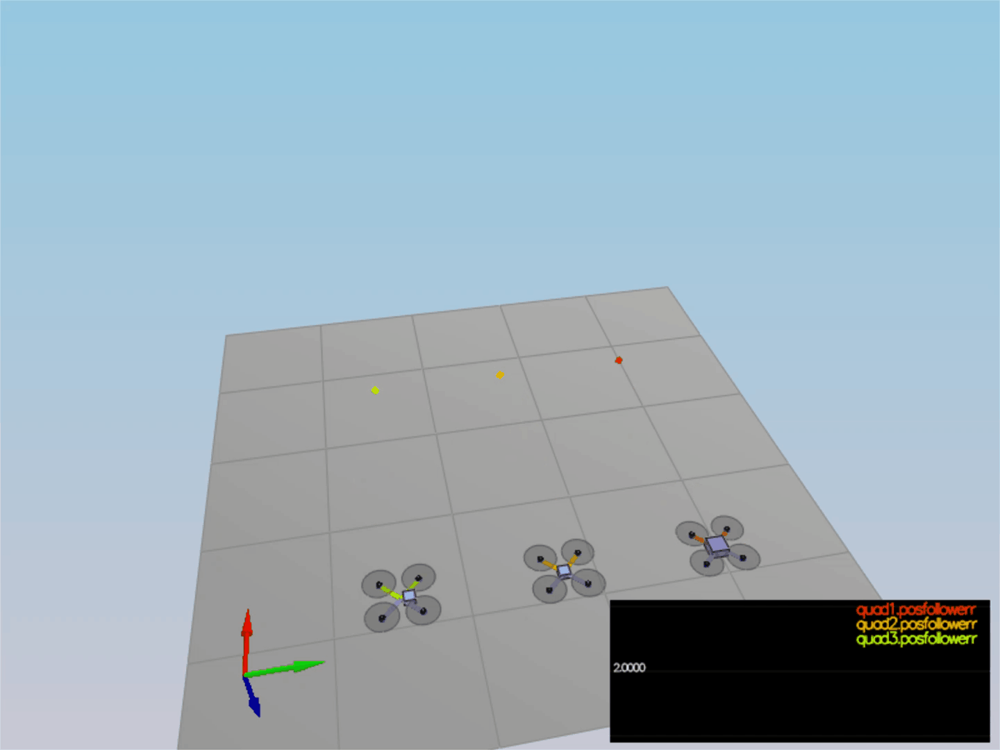

## Development Environment Setup ##

Regardless of your development platform, the first step is to download or clone this repository.

Once you have the code for the simulator, you will need to install the necessary compiler and IDE necessary for running the simulator.

Here are the setup and install instructions for each of the recommended IDEs for each different OS options:


### The Code ###

For the project, the majority of your code will be written in `src/QuadControl.cpp`.  This file contains all of the code for the controller that you will be developing.


When you run the simulator, you'll notice your quad is falling straight down.  This is due to the fact that the thrusts are simply being set to:

```
QuadControlParams.Mass * 9.81 / 4
```

Therefore, if the mass doesn't match the actual mass of the quad, it'll fall down.  Take a moment to tune the `Mass` parameter in `QuadControlParams.txt` to make the vehicle more or less stay in the same spot.

Note: if you want to come back to this later, this scenario is "1_Intro".

With the proper mass, your simulation should look a little like this:

<p align="center">

</p>


## The Tasks ##

For this project, you will be building a controller in C++.  You will be implementing and tuning this controller in several steps.

You may find it helpful to consult the [Python controller code](https://github.com/udacity/FCND-Controls/blob/solution/controller.py) as a reference when you build out this controller in C++.

#### Parameter Tuning


#### Body Rate Control & Roll Pitch Control (scenario 2)

In this scenario, quad starts above the origin with a small initial rotation speed about its roll axis and the task is to stabilize its rotational motion and bring it back to level attitude.

1. Body Rate Control

 - `GenerateMotorCommands()`: Calculates the thrust for each quad using the total thurst, 3-axis moments and the arm length.
 - `BodyRateControl()`: Calculates the target 3-axis moment based on the target and the current body rate. The commanded roll, pitch, and yaw are collected by the body rate controller, and they are translated into the desired rotational accelerations along the axis in the body frame. 

  `$p_{\text{error}} = p_c - p$
   $\bar{u}_p= k_{p-p} p_{\text{error}}$
   $q_{\text{error}} = q_c - q$
   $\bar{u}_q= k_{p-q} q_{\text{error}}$
   $r_{\text{error}} = r_c - r$`

$\bar{u}_r= k_{p-r} r_{\text{error}}$
 - `kpPQR` parameter has the angle ratio gain p=90, q=100, r=10, it gets the vehicle to stop spinning quickly without overshooting

If successful, you should see the rotation of the vehicle about roll (omega.x) get controlled to 0 while other rates remain zero.  Note that the vehicle will keep flying off quite quickly, since the angle is not yet being controlled back to 0.  Also note that some overshoot will happen due to motor dynamics!.

If you come back to this step after the next step, you can try tuning just the body rate omega (without the outside angle controller) by setting `QuadControlParams.kpBank = 0`.

2. Roll Pitch control

 - implement the code in the function `RollPitchControl()`
 - Tune `kpBank` in `QuadControlParams.txt` to minimize settling time but avoid too much overshoot

If successful you should now see the quad level itself (as shown below), though it’ll still be flying away slowly since we’re not controlling velocity/position!  You should also see the vehicle angle (Roll) get controlled to 0.

<p align="center">

</p>


### Position/velocity and yaw angle control (scenario 3)

Next, you will implement the position, altitude and yaw control for your quad.  For the simulation, you will use `Scenario 3`.  This will create 2 identical quads, one offset from its target point (but initialized with yaw = 0) and second offset from target point but yaw = 45 degrees.

 - implement the code in the function `LateralPositionControl()`
 - implement the code in the function `AltitudeControl()`
 - tune parameters `kpPosZ` and `kpPosZ`
 - tune parameters `kpVelXY` and `kpVelZ`

If successful, the quads should be going to their destination points and tracking error should be going down (as shown below). However, one quad remains rotated in yaw.

 - implement the code in the function `YawControl()`
 - tune parameters `kpYaw` and the 3rd (z) component of `kpPQR`

Tune position control for settling time. Don’t try to tune yaw control too tightly, as yaw control requires a lot of control authority from a quadcopter and can really affect other degrees of freedom.  This is why you often see quadcopters with tilted motors, better yaw authority!

<p align="center">

</p>

**Hint:**  For a second order system, such as the one for this quadcopter, the velocity gain (`kpVelXY` and `kpVelZ`) should be at least ~3-4 times greater than the respective position gain (`kpPosXY` and `kpPosZ`).

### Non-idealities and robustness (scenario 4) ###

In this part, we will explore some of the non-idealities and robustness of a controller.  For this simulation, we will use `Scenario 4`.  This is a configuration with 3 quads that are all are trying to move one meter forward.  However, this time, these quads are all a bit different:
 - The green quad has its center of mass shifted back
 - The orange vehicle is an ideal quad
 - The red vehicle is heavier than usual

1. Run your controller & parameter set from Step 3.  Do all the quads seem to be moving OK?  If not, try to tweak the controller parameters to work for all 3 (tip: relax the controller).

2. Edit `AltitudeControl()` to add basic integral control to help with the different-mass vehicle.

3. Tune the integral control, and other control parameters until all the quads successfully move properly.  Your drones' motion should look like this:

<p align="center">

</p>


### Tracking trajectories ###

Now that we have all the working parts of a controller, you will put it all together and test it's performance once again on a trajectory.  For this simulation, you will use `Scenario 5`.  This scenario has two quadcopters:
 - the orange one is following `traj/FigureEight.txt`
 - the other one is following `traj/FigureEightFF.txt` - for now this is the same trajectory.  For those interested in seeing how you might be able to improve the performance of your drone by adjusting how the trajectory is defined, check out **Extra Challenge 1** below!

How well is your drone able to follow the trajectory?  It is able to hold to the path fairly well?


