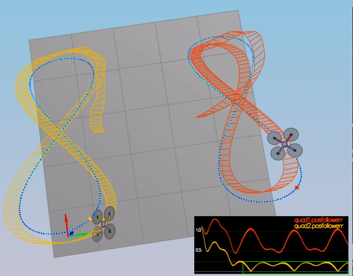

## Project 

The goal of this project is to control a drone in the 3D environment. Here is the architecture of the controller which consists of altitude controller, position controller, and attitude controller:

### Scenario 1

To keep quad from falling straight down mass is set to 0.5

### Scenario 2

In this scenario, quad starts above the origin with a small initial rotation speed about its roll axis and the task is to stabilize its rotational motion and bring it back to level attitude.

##### Body Rate Control

  - `GenerateMotorCommands()`: Calculates the thrust for each quad using the total thurst, 3-axis moments and the arm length.
  - `BodyRateControl()`: Calculates the target 3-axis moment based on the target and the current body rate. The commanded roll, pitch, and   yaw are collected by the body rate controller, and they are translated into the desired rotational accelerations along the axis in the body frame. 
     * `kpPQR`: it gets the vehicle to stop spinning quickly without overshooting
     * u_bar_p = kp_p * (p_target - p_current)
     * u_bar_q = kp_q * (q_target - q_current)
     * u_bar_r = kp_r * (r_target - r_current)
  
  With the angle ratio gain `p=90, q=100, r=10` the rotation of the vehicle about roll (omega.x) get controlled to 0 while other rates remain zero.  

##### Roll Pitch control

 - `RollPitchControl()` is a P controller responsible for commanding the roll and pitch rates in the body frame, it receives the current attitude of the vehicle and sets the target rate of change of the given matrix elements R.
 - `kpBank` parameter minimize the settling time

With `kpBank=10` quad is able to level itself (as shown below), and its angle (Roll) gets controlled to 0.

### Scenario 3

##### Position Velocity Control

 - `LateralPositionControl()`: is a PD Controller to calculate the target horizontal acceleration based on target lateral position/velocity/acceleration and current pose. The drone generates lateral acceleration by changing the body orientation which results in non-zero thrust in the desired direction. Horizontal velocity and acceleration should remain wihin the limits of maxSpeedXY and maxAccelXY.
 - Gain parameters `kpPosXY = 2.5` and `kpPosZ = 5` `kpVelXY = 10` and `kpVelZ = 20`, 
 - `AltitudeControl()`: Calculates the target thrust based on altitude setpoint, actual altitude, vertical velocity setpoint, actual vertical velocity, and a vertical acceleration feed-forward command.
 
As shown below quads go to their destination points and their tracking error are going down.

##### Yaw Control
A P Controller is used to control the drone's yaw by decoupling from the other directions. A P controller.

 - `YawControl()`: Calculate the target yaw rate to control yaw to yawCmd
 - `kpYaw = 5` and the 3rd (z) component of `kpPQR -> R = 10`

###  Scenario 4

In this scenario parameters are tweaked to control non-ideal situations and robustness of controllers for 3 different quads:
 - The green quad has its center of mass shifted back
 - The orange vehicle is an ideal quad
 - The red vehicle is heavier than usual

* `AltitudeControl()`: added integrated altitude Error to the controller to help with the different-mass vehicle 
* `KiPosZ = 20`

As shown below quads move successfully and all cases pass.

###  Scenario 5

Putting it all together and testing the controllers with two quadcopters shows that drones are able to stablize itself and follow trajectories.

